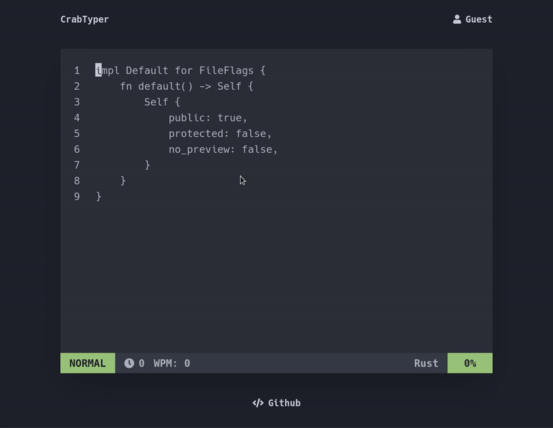

  <h1>Crabtyper 🦀</h1>
  

    <strong>A speedtyping web app written in Rust</strong>
  

  

> This project is inspired by [speedtyper](https://www.speedtyper.dev/) & [monkeytype](https://monkeytype.com/), please go check them out!

  
  

This webaplication is completely written in Rust. Why? Because it's blazingly fast! Well not yet,
currently we still have no direct access to the browsers DOM API from WebAssembly, which is why we
still have to use Javascript to do so. The project is mainly created for learning about Rust and WebAssembly.

## Try it out!

Click [here](https://www.crabtyper.com/) to play the speed typing game. To start the game just click
on the Vim editor and start typing.

Some controls if you are in **NORMAL** mode:

- `i` change to **INSERT** mode
- `n` next snippet

## Planned features

I plan on adding these features:

- [ ] Authentication with your github account
- [ ] Save results and present them in a graph
- [ ] More snippets
- [ ] Smooth carrot
- [ ] ...

## Contribute

Feel free to contribute to this project. Take a look at the current [issues](https://github.com/brancobruyneel/crabtyper/issues) or the [project board](https://github.com/users/brancobruyneel/projects/2)
I will try to keep these updated!

## License

[MIT License](https://github.com/brancobruyneel/crabtyper/blob/main/LICENSE)
